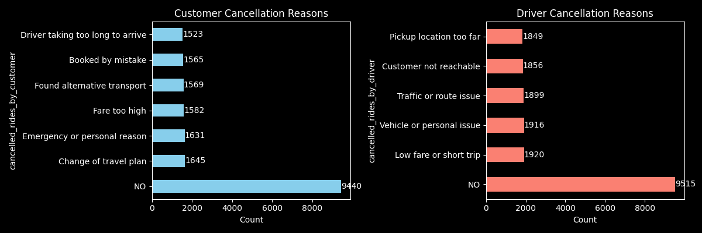

# 🚖 Ola Booking Analysis Project

## 📌 Project Overview

This project analyzes Ola ride booking data to uncover key business insights related to revenue, cancellations, ride distance, and service efficiency. The workflow includes data cleaning, EDA, visualization, and SQL analysis using Python and MySQL. It identifies operational gaps such as high cancellations, fare inefficiencies, and TAT delays. The findings help improve pricing strategy, driver allocation, and overall customer experience.

---

## 🎯 Project Objectives
- Analyze booking status (Completed, Cancelled, Incomplete)
- Identify key reasons for ride cancellations
- Study the impact of VTAT on cancellations
- Understand revenue patterns across ride distances
- Evaluate payment methods and customer ratings
- Generate business-driven insights for decision-making

---

## 📊 Dataset Description
The dataset contains ride-level booking information including:
- Booking status
- Cancellation reasons (Customer & Driver)
- Booking and payment values
- Ride distance
- Vehicle TAT (VTAT) and Customer TAT (CTAT)
- Payment methods
- Customer and driver ratings

    ## Note-

 - Full dataset: `ola_booking_cleaned.csv` (large file - may not preview on GitHub)
 - Sample data: `sample_data.csv` (for quick preview)
 
    [Click here to view sample_data.csv](outputs/sample_data.csv)

  
---

## 🛠 Tools & Technologies Used
- **Python** (Pandas, NumPy, Matplotlib)
- **SQL (MySQL)**
- **Jupyter Notebook**
- **SQLAlchemy** (for SQL-Python integration)

---

## 📁 Project Folder Structure

```
ola_booking_analysis/
|
|-- dataset/
|   |-- Mumbai_Ride_Data.csv 
|
|-- sql_queries/
|   |-- sql_analysis.ipynb
|
|-- outputs/
|   |-- ola_booking_cleaned.csv
|   |-- sample_data.csv
|
|-- Notebook/
|   |-- data_cleaning.ipynb
|   |-- eda.ipynb
|   |-- visualization.ipynb
|   |-- can_analysis.png
|
|--Readme.md


```
---

## 🔍 Analysis Performed
### 1. Data Cleaning
- Handled missing values
- Standardized data types
- Filled VTAT and CTAT for incomplete rides using **median of completed rides**
- Adjusted revenue logic for incomplete rides

### 2. Exploratory Data Analysis (EDA)
- Booking status snalysis
- TAT (avg_vtat & avg_ctat) analysis
- Payment method Analysis
- Revenue & booking value analysis
- Rating analysis
- Cancellation analysis (Driver vs Customer)

### 3. SQL Analysis
- Top 10 busiest pickup locations
- Vehicle type performance
- Payment method analysis
- Cancellation rate analysis by time

### 4. Visualization
- Bar charts for cancellations analysis
- Bar charts for ride distance vs revenue
- Box plots for TAT analysis
- pie chart for payment method

##### cancellation chart-
   

---

## 💡 Key Business Insights
- The dataset shows a strong operational scale with 1,00,000 total bookings, out of which ~62% rides were successfully completed, indicating healthy service fulfillment.
- For incomplete rides caused by drivers, 50% of the booking value was considered as recovered revenue to simulate partial service compensation.
- Missing VTAT and CTAT values for incomplete rides were imputed using the median TAT of completed rides to maintain analytical consistency.
- Revenue analysis reveals a flat fare pattern (~₹490–₹500 per ride) across all ride distance ranges, confirming a base fare + time-based pricing model rather than pure distance-based pricing.
- Short-distance rides (0–5 km) generate significantly higher revenue per kilometer, making them operationally more profitable compared to long-distance trips.
- Customer cancellations are largely driven by change of travel plans, emergencies, and high fare perception, highlighting price sensitivity and dynamic demand behavior.
- Driver cancellations are primarily caused by low fare/short trips, vehicle issues, and traffic constraints, indicating profitability and operational feasibility concerns from the driver side.
- A notable revenue leakage exists due to cancelled and incomplete rides, emphasizing the need for cancellation control strategies and driver allocation optimization.
- Pickup distance and traffic-related driver cancellations suggest route optimization and driver dispatch efficiency as key improvement areas.

##### Overall ratings and completion share indicate positive customer experience, but cancellation and fare perception remain critical business risk factors.
---

## 📈 Business Recommendations

- Introduce Dynamic Pricing by Distance & Demand
Short rides should have minimum assured fares, while long rides should follow distance-based surge pricing to balance driver earnings and company revenue.
- Launch Driver Trip Acceptance Incentive Programs
Provide bonuses for completing short-distance or low-fare rides to reduce driver-side cancellations and improve fulfillment rates.
- Implement Smart Driver–Rider Matching
Use proximity-based auto allocation to assign the nearest available driver, reducing pickup distance, traffic exposure, and cancellation probability.
- Deploy Real-Time ETA & Fare Lock Features
Showing accurate arrival times and locking fares at booking reduces customer uncertainty and prevents last-minute cancellations.
- Create Cancellation Risk Monitoring System
Identify high-risk bookings (high TAT, long pickup, high fare) and trigger preventive actions like driver incentives or customer alerts.
- Optimize Supply in High-Demand Zones
Use demand heatmaps to pre-position drivers in peak areas, reducing wait time and improving ride completion.

  
---

## ▶️ How to Run This Project
1. Download the dataset from the source website.
2. Open the dataset in Jupyter Notebook for data preparation.
3. Execute notebooks in the following order:
   - data_cleaning.ipynb
   - eda.ipynb
   - visualization.ipynb
4. Export the cleaned dataset and load it into MySQL Workbench.
5. Connect Jupyter Notebook to MySQL using the SQLAlchemy library.
6. Run SQL queries in this notebook sql_analysis.ipynb

---

## ✅ Conclusion
This project demonstrates an end-to-end **Data Analytics workflow**
covering data cleaning, SQL analysis, EDA, and visualization to deliver
actionable business insights for ride-hailing operations.

---
 ## Author & Contact

 **Diksha Yadav**
 
 **📧email**:  [diksha12231@gmail.com]
 


---